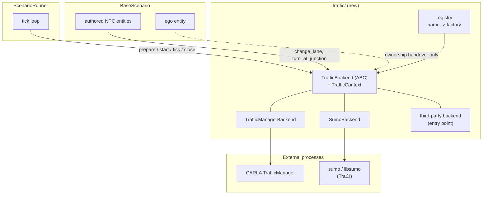
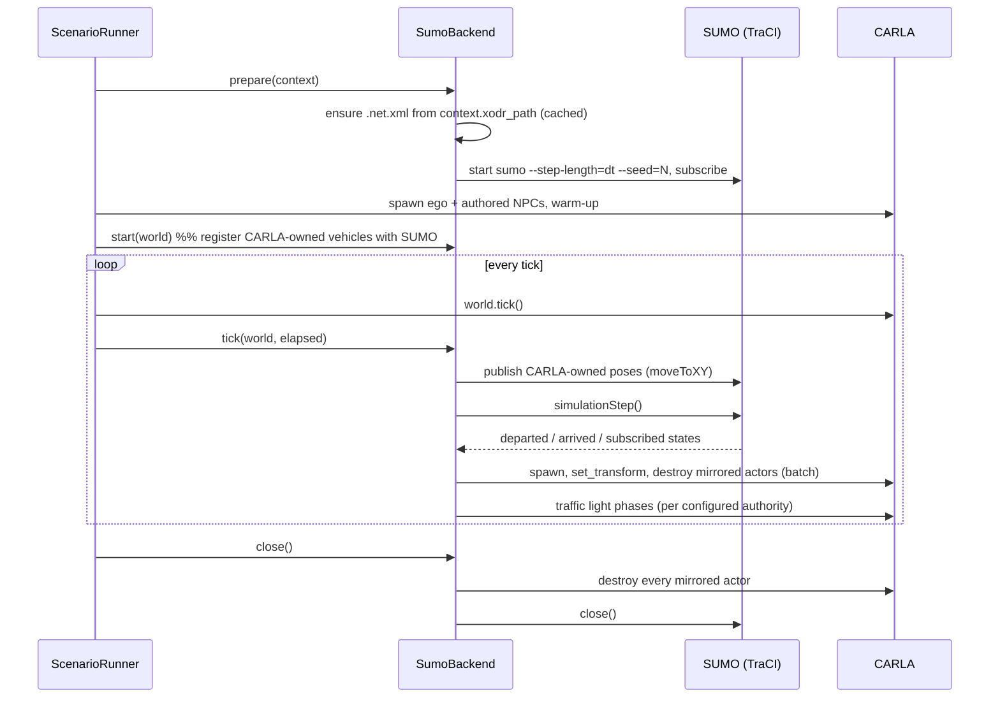

# Design Document

## Overview

A **traffic backend** is the component that owns every vehicle in a run that the scenario
itself did not author, and that answers the manoeuvre intents the scenario asks of the
vehicles it did. Today that component exists but has no name: it is CARLA's
TrafficManager, reached directly from `ScenarioRunner.run()` and from the
`TrafficManagerDriven` mixin.

This design gives it a name, an interface and a registry, then adds SUMO as the second
implementation. The seam is the same one the package already uses twice — the scenario
registry (`registry.py`) and the swappable ego entity (`build_ego_entity` in
`examples/run.py`) — so a reader who knows one knows this.

Two phases matter and are kept strictly apart:

- **Phase A** extracts the seam with no behaviour change. TrafficManager keeps doing
  exactly what it does now, from a new place.
- **Phase B** adds SUMO co-simulation behind that seam.

Phase A is worth merging on its own: it is the part every future backend depends on, and
it is verifiable by the existing test suite staying green.

## Steering Document Alignment

### Technical Standards (tech.md)

- Python 3.10+, type hints throughout, Google-style docstrings, `py.typed` preserved.
- Every dependency arrives as a wheel — no apt, no compiler. SUMO satisfies this:
  `eclipse-sumo` ships the `sumo` and `netconvert` binaries as a PyPI wheel, and `traci`
  and `sumolib` are pure Python. They go into an optional extra, so the default install is
  untouched.
- Constants live in configuration dataclasses, not in module-level magic numbers, per the
  project's constants policy.
- Hydra config groups are the single selection mechanism, as with `ego`, `driver`, `map`.

### Project Structure (structure.md)

- New subpackage `src/autoware_carla_scenario/traffic/`, one module per concern, mirroring
  the existing `driver/` and `maps/` subpackages.
- Tests go to `test/carla_scenario/`, named `test_traffic_*.py`, matching the existing
  naming.
- Public names re-exported from `autoware_carla_scenario/__init__.py` alongside
  `CarlaDriverEntity`, `register_scenario` and friends, because external scenario packages
  import from the top level.

## Code Reuse Analysis

### Existing Components to Leverage

- **`entity/tm_driving.py`** — `compute_turn_route`, `_adjacent_lane`, `_lane_key_of` and
  the lane-change completion test are TrafficManager mechanism. They move to
  `traffic/traffic_manager.py` unchanged; only their caller changes.
- **`registry.py`** — the scenario registry's shape (name → factory, plus entry-point
  discovery via `load_scenario_plugins`) is copied for backends. Same idioms, same
  cheap-import rule.
- **`maps/opendrive.py` (`ensure_xodr`, `capture_opendrive`)** — already produces the
  `.xodr` of the map in play, whether installed by the run or read back from CARLA. It is
  the input to `netconvert`; no new map resolution is written.
- **`maps/cache.py` (`GitMapCache.derived_dir`)** — already the home of artefacts derived
  from a map. The generated `.net.xml` is one more.
- **`coordinate/` (`snap.py`, `transform.py`, `poses.py`)** — ground projection and frame
  conversion for placing mirrored vehicles on the CARLA road surface.
- **`driver/` subpackage** — the precedent for "an external process drives part of the
  run": config dataclass with `from_mapping` validation, an abstract client so tests can
  substitute a fake, lifecycle hooks called from the runner. The SUMO backend follows it.
- **`entity/registry.py`** — role-name → entity lookup, already how actions find who they
  act on; backends reuse it rather than keeping their own actor table.

### Integration Points

- **`ScenarioRunner.run()`** — the `tm.set_synchronous_mode` / `set_random_device_seed`
  block and the `for actor in world.get_actors().filter("vehicle.*"): actor.set_autopilot(...)`
  loop become `backend.prepare()` / `backend.start()`. One `backend.tick()` call joins
  `ego.on_tick()` right after `world.tick()`.
- **`BaseScenario.register_entity()`** — where an NPC is handed its client today; it hands
  it the backend instead.
- **`examples/run.py`** — builds the backend from `cfg.traffic` the same way it builds the
  ego entity from `cfg.ego.entity`.
- **`scenario_config.py`** — gains `TrafficConfig`, `TrafficManagerBackendConfig` and
  `SumoBackendConfig` as part of the stable public API external packages import.
- **Result record** — the backend name and seed are written next to the existing run
  metadata, so a result says what drove it.

## Architecture

### Ownership model

The single rule that keeps the design honest:

> **The scenario owns what it authored. The backend owns the rest. Nothing is owned twice.**

| Vehicle | Created by | Driven by | Visible to the backend simulator |
| --- | --- | --- | --- |
| Ego | Scenario / Autoware interface | Ego entity (`autopilot`, `autoware`, `carla_driver`) | Yes — injected |
| Authored NPC (`register_entity`) | Scenario, in `setup()` | Backend, on request (intents) | Yes — injected |
| Ambient traffic | Backend | Backend | Natively |

This is why authored NPCs are never handed to SUMO to spawn: a scenario's NPC is part of
the test's definition — its spawn pose is swept, its manoeuvres are timed against
conditions — and a demand model is not a place to put it. It is *published* into SUMO so
the flow reacts to it, exactly as the ego is.

### Component diagram



### Tick-level sequence (SUMO backend)



Ordering is deliberate: CARLA state is published *before* SUMO steps, so SUMO plans
against the state the ego is actually in; mirrored actors are written *after* the step,
so what CARLA shows is the result of that step. One SUMO step per CARLA tick, never
zero and never two.

### Modular design principles

- **Single file responsibility**: `base.py` (contract, no simulator imports), `registry.py`
  (names), `traffic_manager.py` (CARLA TM), `sumo/` (its own subpackage: `backend.py`,
  `sync.py`, `net.py`, `types.py`), `config.py` re-exported through `scenario_config.py`.
- **Component isolation**: the mirroring loop (`sync.py`) is written against a narrow
  `TraciLike` protocol so it is unit-testable with a fake, exactly as
  `BaseEgoDriverClient` makes the driver testable without a policy server.
- **No leakage**: no action, condition or scenario imports `traci` or calls
  `get_trafficmanager`.

## Components and Interfaces

### `traffic/base.py` — the contract

- **Purpose:** define what a traffic backend is, without importing CARLA or TraCI.
- **Interfaces:**

```python
@dataclass(frozen=True)
class TrafficContext:
    """Everything a backend needs to know about the run it is joining."""
    client: Any                  # carla.Client
    world: Any                   # carla.World
    map_name: str
    xodr_path: Optional[Path]    # the OpenDRIVE the world is running
    fixed_delta_seconds: float
    random_seed: int
    output_dir: Path


class TrafficBackend(ABC):
    name: ClassVar[str]

    # Lifecycle -- mirrors the ego entity's hooks, called from ScenarioRunner
    def prepare(self, context: TrafficContext) -> None: ...
    def adopt(self, entity: Any) -> None: ...          # an authored NPC/ego joins the run
    def start(self, world: Any) -> None: ...           # after warm-up, before the clock
    def tick(self, world: Any, elapsed: float) -> None: ...
    def close(self) -> None: ...

    # Manoeuvre vocabulary -- what the entities delegate
    def change_lane(self, entity: Any, direction: LaneChangeDirection) -> None: ...
    def lane_change_finished(self, entity: Any) -> bool: ...
    def turn_at_junction(self, entity: Any, direction: TurnDirection, **kw: Any) -> None: ...

    # Reporting
    def describe(self) -> dict[str, Any]: ...          # backend name, seed, versions
```

- **Dependencies:** none beyond the standard library and the enums currently in
  `entity/tm_driving.py`, which move here (`LaneChangeDirection`, `TurnDirection`) and are
  re-exported from their old home for compatibility.
- **Reuses:** the lifecycle vocabulary of `EgoVehicle` (`on_scenario_start`, `on_tick`,
  `on_scenario_end`), so the runner reads consistently.

### `traffic/registry.py` — names

- **Purpose:** map a configured name to a backend factory; discover third-party backends.
- **Interfaces:** `register_backend(name, factory)`, `get_backend_factory(name)`,
  `available_backends()`, `load_traffic_backend_plugins()` over the
  `autoware_carla_scenario.traffic_backends` entry-point group.
- **Reuses:** `registry.py`'s structure verbatim, including its "no heavy imports" rule and
  its unknown-name error that lists what is registered.

### `traffic/traffic_manager.py` — the default backend

- **Purpose:** be exactly today's behaviour, behind the interface.
- **Interfaces:** `TrafficManagerBackend(config: TrafficManagerBackendConfig)`.
  `prepare()` sets synchronous mode and seeds the TM (the block now at
  `scenario_runner.py:580`); `start()` runs the autopilot loop (now at
  `scenario_runner.py:651`), skipping actors it does not own; `tick()` is a no-op, because
  the TM steps with the world; `change_lane` / `turn_at_junction` are the bodies now in
  `TrafficManagerDriven`.
- **Dependencies:** CARLA only.
- **Reuses:** `compute_turn_route` and the lane-change completion test, moved not rewritten.

### `traffic/sumo/net.py` — network derivation

- **Purpose:** turn the run's `.xodr` into a `.net.xml`, once, cached.
- **Interfaces:** `ensure_sumo_net(xodr: Path, *, cache_dir: Path, options: NetconvertOptions) -> Path`.
- **Behaviour:** runs `netconvert --opendrive-files <xodr> --output-file <net>` with the
  option set CARLA's own co-simulation uses (`--geometry.min-radius.fix`,
  `--opendrive.import-all-lanes`, `--offset.disable-normalization true` so SUMO keeps the
  OpenDRIVE origin and no second offset has to be tracked). Keyed by a hash of the
  OpenDRIVE content plus the option set, so an edited map regenerates and an unchanged one
  does not.
- **Dependencies:** the `netconvert` binary from the `eclipse-sumo` wheel.
- **Reuses:** `maps/cache.py` for the cache directory; `maps/opendrive.py` for the input.

### `traffic/sumo/sync.py` — the co-simulation loop

- **Purpose:** hold the per-tick exchange, and nothing else.
- **Interfaces:** `SumoCarlaSync(traci_like, world_adapter, mapping, config)` with
  `publish_owned(...)`, `step()`, `apply_to_carla(...)`, `sync_traffic_lights(...)`.
- **Dependencies:** a `TraciLike` protocol and a `WorldLike` protocol — neither imports
  its library — so the whole loop is unit-testable with fakes.
- **Reuses:** `coordinate/transform.py` for the CARLA↔SUMO frame conversion (SUMO's
  network origin is the OpenDRIVE origin given the netconvert options above, and its y
  axis is left-handed relative to CARLA's), `coordinate/snap.py` for putting a mirrored
  vehicle on the road surface.

### `traffic/sumo/backend.py` — the SUMO backend

- **Purpose:** the `TrafficBackend` implementation: process lifecycle, vehicle-type
  mapping, and the intents.
- **Interfaces:** `SumoBackend(config: SumoBackendConfig)`.
- **Intent mapping:** `change_lane` → `traci.vehicle.changeLane`; `turn_at_junction` →
  `traci.vehicle.setRoute` onto the junction's outgoing edge in that direction (resolved
  with `sumolib` from the net, not from CARLA waypoints). An authored NPC that CARLA owns
  and SUMO only observes cannot be steered by SUMO; for those the backend delegates to the
  TM backend it composes, or — when TM is not wanted at all — logs that the intent is not
  available. Requirement 1.3: never raise into the tick loop.
- **Dependencies:** `traci` (or `libsumo` when `use_libsumo: true`), `sumolib`.

### `entity/` changes

- **Purpose:** entities stop knowing about TrafficManager.
- **Change:** `TrafficManagerDriven` becomes `BackendDriven`, holding
  `_traffic_backend` and delegating each manoeuvre to it.
  `TrafficManagerDriven` stays as a deprecated subclass, and `set_client(client, tm_port)`
  keeps working by constructing a `TrafficManagerBackend` on the spot — external scenario
  packages call it, and `scenario_config.py`'s docstring promises them a stable API.
- **Reuses:** `entity/registry.py` for role-name lookup; the protocols `LaneChanging` and
  `TurningAtJunctions` are unchanged, which is why actions need no edit at all.

## Data Models

### TrafficConfig (Hydra group `traffic`, in `scenario_config.py`)

```
TrafficConfig
- backend: str = "traffic_manager"        # registry name
- traffic_manager: TrafficManagerBackendConfig
- sumo: SumoBackendConfig

TrafficManagerBackendConfig
- port: int = 8100                        # falls back to the legacy traffic_manager.port
- hybrid_physics_mode: bool = False
- hybrid_physics_radius_m: float = 70.0
- global_percentage_speed_difference: float = 0.0
- auto_lane_change: bool = True

SumoBackendConfig
- binary: str = "sumo"                    # "sumo-gui" to watch it
- use_libsumo: bool = False               # in-process, faster, no GUI
- net_path: str | None = None             # derived from the map's xodr when unset
- route_path: str | None = None           # explicit demand; else `ambient` generates it
- additional_files: list[str] = []
- step_length: float | None = None        # defaults to the world's fixed_delta_seconds
- seed: int | None = None                 # defaults to the scenario's random_seed
- traffic_light_authority: str = "carla"  # carla | sumo | none
- vtype_mapping_path: str | None = None   # SUMO vType -> CARLA blueprint
- spawn_radius_m: float | None = None     # only mirror vehicles near the ego; None = all
- ambient: AmbientTrafficConfig

AmbientTrafficConfig
- enabled: bool = True
- vehicles_per_hour: float = 600.0
- fringe_factor: float = 5.0              # randomTrips.py demand shaping
- period_s: float | None = None
```

### VehicleMapping (runtime, `traffic/sumo/types.py`)

```
MirroredVehicle
- sumo_id: str
- carla_actor_id: int
- blueprint: str
- spawned_tick: int

PublishedVehicle          # CARLA-owned, injected into SUMO
- role_name: str
- sumo_id: str
- carla_actor_id: int
```

## Error Handling

### Error Scenarios

1. **Unknown backend name**
   - **Handling:** `get_backend_factory` raises `ValueError` listing registered names, at
     config-build time in `examples/run.py`, before a CARLA session exists.
   - **User Impact:** immediate, actionable message; nothing is spawned.

2. **SUMO not installed / `netconvert` missing**
   - **Handling:** `SumoBackend.prepare()` raises `TrafficBackendUnavailable` naming the
     extra (`uv sync --extra sumo`). Import of `traci` is lazy, inside `prepare()`.
   - **User Impact:** the run fails at startup with the install command to run.

3. **`netconvert` fails on the converted OpenDRIVE**
   - **Handling:** raise with `netconvert`'s stderr attached and the path of the `.xodr`
     that produced it — most likely a converter defect worth reporting upstream in this
     same repository.
   - **User Impact:** a reproducible complaint about a specific map, not a silent
     empty network.

4. **SUMO process dies mid-run**
   - **Handling:** `tick()` catches the TraCI error, marks the backend failed, and the
     runner ends the scenario as a failure attributed to the backend (not the timeout).
   - **User Impact:** the result says the traffic backend died, with SUMO's own log path.

5. **A mirrored vehicle cannot be spawned in CARLA** (blueprint missing, occupied space)
   - **Handling:** log once per SUMO id, skip it for this run, keep simulating. SUMO keeps
     the vehicle; CARLA simply does not show it.
   - **User Impact:** a warning, not a crash; density is reported at the end.

6. **Both TM and a non-TM backend would drive one actor**
   - **Handling:** `start()` builds the skip set from the ownership table, and an assertion
     in the TM backend refuses to autopilot an actor another backend has adopted.
   - **User Impact:** a developer-facing error rather than two controllers fighting over a
     vehicle at runtime.

## Testing Strategy

### Unit Testing

- **Backend contract suite**: one parameterized test module every backend must pass, run
  with fake CARLA/TraCI doubles — lifecycle ordering, no-op tick safety, idempotent
  `close()`, intents that never raise.
- **Registry**: registration, unknown-name error text, entry-point discovery.
- **`sync.py`**: departure/arrival handling, transform conversion (round-trip through a
  known OpenDRIVE origin), traffic-light authority in each direction, `spawn_radius_m`
  filtering. All against fakes — no CARLA, no SUMO.
- **`net.py`**: cache key behaviour (same xodr → no regeneration, changed xodr →
  regeneration), `netconvert` failure surfaced with stderr. The binary itself is faked in
  unit tests and exercised for real in one `slow`-marked test.
- **Config**: `from_mapping` rejects unknown keys (the `_checked` pattern from
  `driver/base.py`), legacy `traffic_manager.port` still resolves.

### Integration Testing

- `pytest.mark.integration` (requires a CARLA server, as today) for the TM backend —
  asserting the extracted seam is behaviour-identical to the pre-refactor runner.
- A new `pytest.mark.slow` test converting the `nishishinjuku` fixture's `.xodr` with the
  real `netconvert` and asserting the network has the expected edge/junction counts —
  this needs no CARLA and can run in CI.

### End-to-End Testing

- `uv run scenario scenario=intersection_passing/left_turn traffic=sumo` against a live
  CARLA + SUMO: ego completes the scenario, ambient vehicles appear and disappear, the
  result record names the backend, and two runs with the same seed produce the same
  vehicle count trace.
- The existing end-to-end suite, unchanged, is the regression test for Phase A: it must
  pass with no edits.

## Open Decisions

These want a decision before Phase B starts; each has a recommended answer.

1. **Who has physics for mirrored vehicles?** *Recommended:* SUMO is authoritative —
   mirrored actors have physics disabled and are moved by `set_transform`, the model
   CARLA's own co-simulation uses. The alternative (SUMO as a planner giving target speed
   and lane to a CARLA-physics vehicle) gives better dynamics and collision response but
   drifts from SUMO's own state and is much more work. Revisit as a later `sumo_planner`
   backend if dynamics matter.
2. **Traffic lights.** *Recommended:* CARLA authoritative by default, because Autoware
   perceives CARLA's lights and the scenario conditions already read them.
3. **`traci` vs `libsumo`.** *Recommended:* `traci` by default (supports `sumo-gui`,
   debuggable), `libsumo` behind a flag for throughput.
4. **Where ambient demand comes from.** *Recommended:* generate it with `randomTrips.py`
   from the derived network, cached beside it, seeded; an explicit `route_path` always
   wins. Scenario-document-authored flows are a later phase.
5. **Does the `traffic` group belong in the scenario document (editor)?** *Recommended:*
   not in the first release — keep it a run-level Hydra choice so one document can be run
   under several traffic models. Add it to the document only once a scenario needs to
   *depend* on a specific flow.
