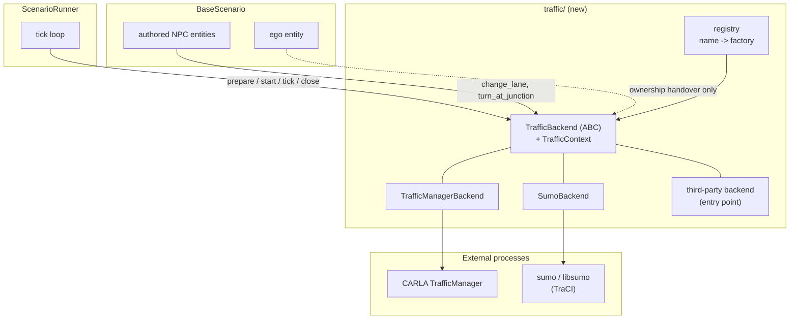
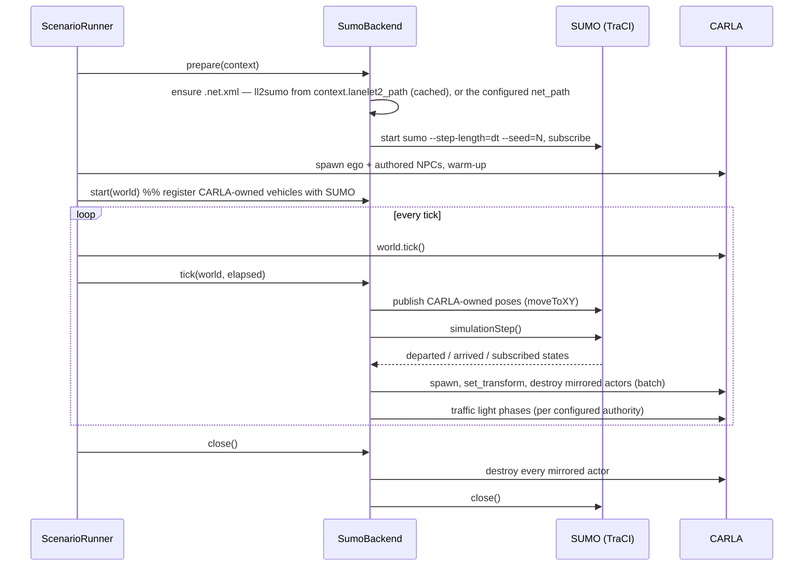

# Design Document

## Overview

A **traffic backend** is the component that owns every vehicle in a run that the scenario
itself did not author, and that answers the manoeuvre intents the scenario asks of the
vehicles it did. Today that component exists but has no name: it is CARLA's
TrafficManager, reached directly from `ScenarioRunner.run()` and from the
`TrafficManagerDriven` mixin.

This design gives it a name, an interface and a registry, then adds SUMO as the second
implementation. The seam is the same one the package already uses twice — the scenario
registry (`registry.py`) and the swappable ego entity (`build_ego_entity` in
`examples/run.py`) — so a reader who knows one knows this.

Two phases matter and are kept strictly apart:

- **Phase A** extracts the seam with no behaviour change. TrafficManager keeps doing
  exactly what it does now, from a new place.
- **Phase B** adds SUMO co-simulation behind that seam.

Phase A is worth merging on its own: it is the part every future backend depends on, and
it is verifiable by the existing test suite staying green.

> **Status.** Phase A is implemented: `traffic/` holds the seam, the TrafficManager is one
> backend behind it, `none` is a second, and `traffic=` in the Hydra config selects between
> them.  What it looks like from the outside is documented in
> [`autoware_carla_scenario/docs/traffic_backends.md`](../../../autoware_carla_scenario/docs/traffic_backends.md);
> this document stays the design record, including for Phase B.  Two things were decided
> differently once written, and the text below reflects what was built: `TrafficBackend` is
> a plain base class with working defaults rather than an ABC, so a backend implements only
> what it does; and a backend's own settings travel as an `options` mapping rather than as
> a typed node per simulator in the shared config, so a third-party backend needs no edit
> here.

## Steering Document Alignment

### Technical Standards (tech.md)

- Python 3.10+, type hints throughout, Google-style docstrings, `py.typed` preserved.
- Every dependency arrives as a wheel — no apt, no compiler. SUMO satisfies this:
  `eclipse-sumo` ships the `sumo` and `netconvert` binaries as a PyPI wheel, and `traci`
  and `sumolib` are pure Python. They go into an optional extra, so the default install is
  untouched.
- The network converter,
  [`ll2sumo`](https://github.com/autowarefoundation/lanelet2_to_sumo), is pure Python
  (`pyproj` + `sumolib`) and needs no compiler either, but it is **not published to PyPI**,
  so the extra pins it by git reference. That is a real difference from the rest of the
  workspace and is stated rather than glossed: a git dependency cannot be resolved from an
  index mirror, and the repository carries no `LICENSE` file at the time of writing —
  both worth settling before the extra is added (task 10).
- Constants live in configuration dataclasses, not in module-level magic numbers, per the
  project's constants policy.
- Hydra config groups are the single selection mechanism, as with `ego`, `driver`, `map`.

### Project Structure (structure.md)

- New subpackage `src/autoware_carla_scenario/traffic/`, one module per concern, mirroring
  the existing `driver/` and `maps/` subpackages.
- Tests go to `test/carla_scenario/`, named `test_traffic_*.py`, matching the existing
  naming.
- Public names re-exported from `autoware_carla_scenario/__init__.py` alongside
  `CarlaDriverEntity`, `register_scenario` and friends, because external scenario packages
  import from the top level.

## Code Reuse Analysis

### Existing Components to Leverage

- **`entity/tm_driving.py`** — `compute_turn_route`, `_adjacent_lane`, `_lane_key_of` and
  the lane-change completion test are TrafficManager mechanism. They move to
  `traffic/traffic_manager.py` unchanged; only their caller changes.
- **`registry.py`** — the scenario registry's shape (name → factory, plus entry-point
  discovery via `load_scenario_plugins`) is copied for backends. Same idioms, same
  cheap-import rule.
- **The scenario's Lanelet2 map (`MapConfig.lanelet2_path`, `maps.resolve_map_paths`)** —
  the `.osm` every run already names, and the input `ll2sumo` converts. No new map
  resolution is written, and the SUMO network comes from the same file Autoware plans on
  rather than from a second derivation of it.
- **`maps/opendrive.py` (`ensure_xodr`, `capture_opendrive`)** — still resolves the
  `.xodr` the CARLA world is running. The SUMO backend does not convert it, but
  `TrafficContext` keeps carrying it for a backend whose own format is OpenDRIVE.
- **`maps/cache.py` (`GitMapCache.derived_dir`)** — already the home of artefacts derived
  from a map. The generated `.net.xml` is one more.
- **`coordinate/` (`snap.py`, `transform.py`, `poses.py`, `map_manager.py`)** — ground
  projection and frame conversion for placing mirrored vehicles on the CARLA road surface.
  A Lanelet2-derived SUMO network is in the *projected Lanelet2 frame*, which is the frame
  `MapManager` is already initialised with, so the CARLA ↔ SUMO conversion is the
  Lanelet2 ↔ CARLA conversion this package already owns rather than a new one.
- **`coordinate/traffic_light.py`
  (`lanelet2_traffic_light_id_to_opendrive_controller_id`, `find_nearest_traffic_light`)** —
  already joins a Lanelet2 traffic light to the CARLA one. `ll2sumo` emits the other half
  of that join (Lanelet2 signal → SUMO `tlLogic`), so the two simulators' signals meet on
  Lanelet2 ids rather than on geometry.
- **`driver/` subpackage** — the precedent for "an external process drives part of the
  run": config dataclass with `from_mapping` validation, an abstract client so tests can
  substitute a fake, lifecycle hooks called from the runner. The SUMO backend follows it.
- **`entity/registry.py`** — role-name → entity lookup, already how actions find who they
  act on; backends reuse it rather than keeping their own actor table.

### Integration Points

- **`ScenarioRunner.run()`** — the `tm.set_synchronous_mode` / `set_random_device_seed`
  block and the `for actor in world.get_actors().filter("vehicle.*"): actor.set_autopilot(...)`
  loop become `backend.prepare()` / `backend.start()`. One `backend.tick()` call joins
  `ego.on_tick()` right after `world.tick()`.
- **`BaseScenario.register_entity()`** — where an NPC is handed its client today; it hands
  it the backend instead.
- **`examples/run.py`** — builds the backend from `cfg.traffic` the same way it builds the
  ego entity from `cfg.ego.entity`.
- **`scenario_config.py`** — gains `TrafficConfig`, `TrafficManagerBackendConfig` and
  `SumoBackendConfig` as part of the stable public API external packages import.
- **Result record** — the backend name and seed are written next to the existing run
  metadata, so a result says what drove it.

## Architecture

### Ownership model

The single rule that keeps the design honest:

> **The scenario owns what it authored. The backend owns the rest. Nothing is owned twice.**

| Vehicle | Created by | Driven by | Visible to the backend simulator |
| --- | --- | --- | --- |
| Ego | Scenario / Autoware interface | Ego entity (`autopilot`, `autoware`, `carla_driver`) | Yes — injected |
| Authored NPC (`register_entity`) | Scenario, in `setup()` | Backend, on request (intents) | Yes — injected |
| Ambient traffic | Backend | Backend | Natively |

This is why authored NPCs are never handed to SUMO to spawn: a scenario's NPC is part of
the test's definition — its spawn pose is swept, its manoeuvres are timed against
conditions — and a demand model is not a place to put it. It is *published* into SUMO so
the flow reacts to it, exactly as the ego is.

### Component diagram



### Tick-level sequence (SUMO backend)



Ordering is deliberate: CARLA state is published *before* SUMO steps, so SUMO plans
against the state the ego is actually in; mirrored actors are written *after* the step,
so what CARLA shows is the result of that step. One SUMO step per CARLA tick, never
zero and never two.

### Modular design principles

- **Single file responsibility**: `base.py` (contract, no simulator imports), `registry.py`
  (names), `traffic_manager.py` (CARLA TM), `sumo/` (its own subpackage: `backend.py`,
  `sync.py`, `net.py`, `types.py`), `config.py` re-exported through `scenario_config.py`.
- **Component isolation**: the mirroring loop (`sync.py`) is written against a narrow
  `TraciLike` protocol so it is unit-testable with a fake, exactly as
  `BaseEgoDriverClient` makes the driver testable without a policy server.
- **No leakage**: no action, condition or scenario imports `traci` or calls
  `get_trafficmanager`.

## Components and Interfaces

### `traffic/base.py` — the contract

- **Purpose:** define what a traffic backend is, without importing CARLA or TraCI.
- **Interfaces:**

```python
@dataclass(frozen=True)
class TrafficContext:
    """Everything a backend needs to know about the run it is joining."""
    client: Any                  # carla.Client
    world: Any                   # carla.World
    map_name: str
    xodr_path: Optional[Path]    # the OpenDRIVE the world is running
    lanelet2_path: Optional[Path]  # the Lanelet2 map of the run; Phase B adds this field,
                                   # because it is what the SUMO network is built from
    fixed_delta_seconds: float
    random_seed: int
    output_dir: Path


class TrafficBackend:
    """Every method has a working default, so a backend implements only what it does."""

    name: ClassVar[str] = "unnamed"

    # Lifecycle -- mirrors the ego entity's hooks, called from ScenarioRunner
    def prepare(self, context: TrafficContext) -> None: ...
    def adopt(self, entity: Any) -> None: ...          # an authored NPC/ego joins the run
    def start(self, world: Any, *, skip_actor_ids: Collection[int] = ()) -> None: ...
    def tick(self, world: Any, elapsed: float) -> None: ...
    def close(self) -> None: ...

    # Manoeuvre vocabulary -- what the entities delegate.  `world` is passed because a
    # backend resolves the intent against the road network.
    def change_lane(self, entity: Any, world: Any, direction: LaneChangeDirection) -> None: ...
    def lane_change_finished(self, entity: Any, world: Any) -> bool: ...
    def turn_at_junction(self, entity: Any, world: Any, direction: TurnDirection, **kw: Any) -> None: ...

    # Reporting
    def describe(self) -> dict[str, Any]: ...          # backend name, seed, versions
```

`NullTrafficBackend` (`traffic.backend=none`) is the whole of a backend that drives
nothing, and the smallest proof that the seam is one: selecting it changes the run without
changing a line of the runner.

- **Dependencies:** none beyond the standard library and the enums currently in
  `entity/tm_driving.py`, which move here (`LaneChangeDirection`, `TurnDirection`) and are
  re-exported from their old home for compatibility.
- **Reuses:** the lifecycle vocabulary of `EgoVehicle` (`on_scenario_start`, `on_tick`,
  `on_scenario_end`), so the runner reads consistently.

### `traffic/registry.py` — names

- **Purpose:** map a configured name to a backend factory; discover third-party backends.
- **Interfaces:** `register_backend(name, factory)`, `get_backend_factory(name)`,
  `available_backends()`, `load_traffic_backend_plugins()` over the
  `autoware_carla_scenario.traffic_backends` entry-point group.
- **Reuses:** `registry.py`'s structure verbatim, including its "no heavy imports" rule and
  its unknown-name error that lists what is registered.

### `traffic/traffic_manager.py` — the default backend

- **Purpose:** be exactly today's behaviour, behind the interface.
- **Interfaces:** `TrafficManagerBackend(config: TrafficManagerBackendConfig)`.
  `prepare()` sets synchronous mode and seeds the TM (the block now at
  `scenario_runner.py:580`); `start()` runs the autopilot loop (now at
  `scenario_runner.py:651`), skipping actors it does not own; `tick()` is a no-op, because
  the TM steps with the world; `change_lane` / `turn_at_junction` are the bodies that were
  in `entity/tm_driving.py`.
- **Dependencies:** CARLA only.
- **Reuses:** `compute_turn_route` and the lane-change completion test, moved not rewritten.

### `traffic/sumo/net.py` — where the network comes from

- **Purpose:** put a `.net.xml` in front of the backend, by either of the two routes below,
  and hand back the same thing in both cases: a path, plus what the backend needs to line
  that network up with CARLA.
- **Interfaces:**

```python
@dataclass(frozen=True)
class SumoNetwork:
    """The network in play, however it was obtained."""

    net_path: Path
    #: `<location netOffset= projParameter=>` read off the net file itself.
    net_offset: tuple[float, float]
    proj_parameter: str
    #: `signal_id_mapping.json`, when the network was generated with signals.
    signal_mapping_path: Optional[Path]
    #: `randomtrips.safe.*` weight files, when the network was generated.
    randomtrips_weight_prefix: Optional[Path]
    #: True when this run generated it, False when the config supplied it.
    generated: bool


def ensure_sumo_network(config: SumoBackendConfig, context: TrafficContext) -> SumoNetwork: ...
```

#### Route 1 — generated from the scenario's Lanelet2 map (the default)

[`ll2sumo`](https://github.com/autowarefoundation/lanelet2_to_sumo) converts a Lanelet2
`.osm` straight into a SUMO network, so generation is a library call rather than anything
this package writes:

```python
from ll2sumo import convert_map

result = convert_map(
    input_path=context.lanelet2_path,          # the .osm the run already names
    out_dir=cache_dir,
    lane_change_mode=config.lane_change_mode,  # "unrestricted" | "lanelet-infer"
    signal_mode=config.signal_mode,            # "jp-static" | "none"
)
# result: {"net_path", "signal_mapping_path", "report_path", "sidecar_path", ...}
```

It writes `network.net.xml` plus `conversion.report.json`, `signal_id_mapping.json` and
`randomtrips.safe.{src,dst,via}.xml` into *out_dir*. Internally it exports SUMO plain XML
and runs `netconvert` itself, so this package never assembles a `netconvert` command line.

**Lanelet2 rather than OpenDRIVE, for three reasons.** The Lanelet2 map is what Autoware
plans on, so the traffic model and the stack under test read the same road network rather
than two derivations of it that can disagree. The converter is lane-level by construction
— lanelets become SUMO edges and lanes, `intersection_area` becomes an intersection
cluster — where an OpenDRIVE round trip would pass through a geometry format twice. And it
emits the Lanelet2 ↔ SUMO signal mapping described below, which an OpenDRIVE-derived
network cannot: the Lanelet2 ids would already have been lost.

Caching: keyed by a hash of the `.osm` content plus the conversion options, under
`maps/cache.py`'s derived directory. An edited map regenerates; an unchanged one is read
from disk. Generation happens in `prepare()`, never inside the tick loop.

#### Route 2 — a `.net.xml` the config names

`traffic.options.net_path` supplies a network directly and short-circuits Route 1
entirely: nothing is converted, nothing is cached, and the file is used as it sits.

```bash
uv run scenario traffic=sumo traffic.options.net_path=/maps/shinjuku.net.xml
```

This exists because a generated network is not always the one you want to run:

- a network **hand-tuned in `netedit`** — speeds, priorities, a turn lane the converter
  could not infer — which a regeneration would silently discard;
- a network from **another toolchain** (OSM via `osmWebWizard`, an OpenDRIVE import, one a
  traffic-engineering team already calibrated);
- **iteration speed**: converting a dense urban map takes seconds to minutes, and a sweep
  that runs one scenario a hundred times should pay that once, offline;
- **an environment without the converter**: running against a prepared network needs only
  `traci`, so a CI job or a slim container can drop `ll2sumo`, `pyproj` and `netconvert`
  entirely.

What the backend does with such a file, and what it does *not* assume:

1. **The geo-reference is read from the file, never assumed.** Every SUMO network carries
   `<location netOffset="..." convBoundary="..." origBoundary="..." projParameter="..."/>`,
   and `ll2sumo` writes exactly those when it converts. The backend reads that header
   (`sumolib.net.readNet`) on both routes, so the CARLA ↔ SUMO transform is derived the
   same way whether the network was generated here or brought along.
2. **A mismatch is refused, not tolerated.** The net's `projParameter` and offset are
   checked against the Lanelet2 map's own projection: a network built for a different map,
   or in a different UTM zone, puts every mirrored vehicle in the wrong place, which reads
   as a broken scenario rather than as a misconfiguration. A projection difference is an
   error; an offset difference beyond tolerance is a warning; and
   `traffic.options.trust_net_georeference=true` overrides both for someone who knows
   better.
3. **What degrades is stated.** A supplied network brings no `signal_id_mapping.json`, so
   Lanelet2 → SUMO traffic-light synchronisation is unavailable unless
   `traffic.options.signal_mapping_path` names one; without it the backend logs once that
   signals are not synchronised and leaves SUMO's own TLS running. There are likewise no
   `randomtrips.safe.*` weights, so ambient demand needs an explicit `route_path`.

- **Dependencies:** `ll2sumo` (Route 1 only), `sumolib` (both routes).
- **Reuses:** `maps/cache.py` for the cache directory; `maps.resolve_map_paths` for the
  `.osm`.

### `traffic/sumo/sync.py` — the co-simulation loop

- **Purpose:** hold the per-tick exchange, and nothing else.
- **Interfaces:** `SumoCarlaSync(traci_like, world_adapter, mapping, config)` with
  `publish_owned(...)`, `step()`, `apply_to_carla(...)`, `sync_traffic_lights(...)`.
- **Dependencies:** a `TraciLike` protocol and a `WorldLike` protocol — neither imports
  its library — so the whole loop is unit-testable with fakes.
- **Reuses:** `coordinate/transform.py` and `MapManager` for the CARLA ↔ SUMO frame
  conversion, and `coordinate/snap.py` for putting a mirrored vehicle on the road surface.
  The conversion is short because a Lanelet2-derived network shares the Lanelet2 map's
  projected frame: SUMO coordinates are that frame plus the net's own `netOffset`, and the
  Lanelet2 ↔ CARLA half is what this package already does for every spawn pose. The offset
  and projection are read from the net file's `<location>` header rather than assumed, so a
  network supplied by the config (Route 2) goes through the same path.
- **Traffic lights:** `ll2sumo`'s `signal_id_mapping.json` carries
  `lanelet_signal_to_sumo_links` — a Lanelet2 `refers` way id to the SUMO
  `tlLogic id + linkIndex` records it controls — which is the lookup this loop needs. With
  `traffic_light_authority: carla` (the default) each CARLA light's state is written to its
  SUMO links with `traci.trafficlight.setRedYellowGreenState`; with `sumo` the direction
  reverses. The Lanelet2 id is the join on both sides, because
  `coordinate/traffic_light.py` already maps that same id to the CARLA light.

### `traffic/sumo/backend.py` — the SUMO backend

- **Purpose:** the `TrafficBackend` implementation: process lifecycle, vehicle-type
  mapping, and the intents.  It does not build a network — `prepare()` asks
  `ensure_sumo_network()` for one and starts SUMO on whatever comes back, so the generated
  and the supplied network are the same thing from here on.
- **Interfaces:** `SumoBackend(config: SumoBackendConfig)`.
- **Intent mapping:** `change_lane` → `traci.vehicle.changeLane`; `turn_at_junction` →
  `traci.vehicle.setRoute` onto the junction's outgoing edge in that direction (resolved
  with `sumolib` from the net, not from CARLA waypoints). An authored NPC that CARLA owns
  and SUMO only observes cannot be steered by SUMO; for those the backend delegates to the
  TM backend it composes, or — when TM is not wanted at all — logs that the intent is not
  available. Requirement 1.3: never raise into the tick loop.
- **Dependencies:** `traci` (or `libsumo` when `use_libsumo: true`), `sumolib`.

### `entity/` changes

- **Purpose:** entities stop knowing about TrafficManager.
- **Change:** the mixin is `BackendDriven` in `traffic/driven.py` -- the vehicle half of the
  seam, beside the backend half rather than in `entity/` -- holding
  `_traffic_backend` and delegating each manoeuvre to it.  `entity/tm_driving.py` and its
  deprecated `TrafficManagerDriven` subclass are deleted rather than kept as a shim: this
  ships as a major version, so an import that moved is allowed to move.  The vocabulary it
  re-exported (`LaneChangeDirection`, `TurnDirection`, `LaneChanging`,
  `TurningAtJunctions`, `compute_turn_route`) is importable from `traffic` instead.
  `set_client(client, tm_port)` keeps working: with no
  backend injected, a manoeuvre resolves to a `TrafficManagerBackend` built on the spot,
  which is what such an entity always meant — external scenario packages call it, and
  `scenario_config.py`'s docstring promises them a stable API.  The lane-change
  bookkeeping (`_lane_change_target`, `_lane_change_map`) stays on the entity: a backend is
  shared by the whole run, and the entity is the one thing there is exactly one of per
  manoeuvre.
- **Reuses:** `entity/registry.py` for role-name lookup; the protocols `LaneChanging` and
  `TurningAtJunctions` are unchanged, which is why actions need no edit at all.

## Data Models

### TrafficConfig (Hydra group `traffic`, in `traffic/config.py`)

One shared node says *which* backend drives the run; everything else is the backend's own
and travels as a plain mapping, which is what keeps a third-party backend from needing a
field in a dataclass this package owns.

```
TrafficConfig
- backend: str = "traffic_manager"        # registry name
- options: dict[str, Any] = {}            # the backend's own node, passed verbatim

TrafficManagerBackendConfig               # built from `options` by the backend
- port: int = 8100                        # falls back to the legacy traffic_manager.port

SumoBackendConfig                         # Phase B, built from `options`
- binary: str = "sumo"                    # "sumo-gui" to watch it
- use_libsumo: bool = False               # in-process, faster, no GUI

# --- the network: route 2 when net_path is set, route 1 otherwise ------------
- net_path: str | None = None             # an existing .net.xml; skips conversion entirely
- signal_mapping_path: str | None = None  # ll2sumo's signal_id_mapping.json for that net
- trust_net_georeference: bool = False    # accept a net whose <location> disagrees
- lane_change_mode: str = "unrestricted"  # ll2sumo: unrestricted | lanelet-infer
- signal_mode: str = "jp-static"          # ll2sumo: jp-static | none
- netconvert_binary: str | None = None    # passed through to ll2sumo; else sumolib resolves

# --- demand ------------------------------------------------------------------
- route_path: str | None = None           # explicit demand; else `ambient` generates it
- additional_files: list[str] = []

# --- the run -----------------------------------------------------------------
- step_length: float | None = None        # defaults to the world's fixed_delta_seconds
- seed: int | None = None                 # defaults to the scenario's random_seed
- traffic_light_authority: str = "carla"  # carla | sumo | none
- vtype_mapping_path: str | None = None   # SUMO vType -> CARLA blueprint
- spawn_radius_m: float | None = None     # only mirror vehicles near the ego; None = all
- ambient: AmbientTrafficConfig

AmbientTrafficConfig
- enabled: bool = True
- vehicles_per_hour: float = 600.0
- fringe_factor: float = 5.0              # randomTrips.py demand shaping
- period_s: float | None = None
- use_safe_weights: bool = True           # ll2sumo's randomtrips.safe.* weights, which
                                          # zero out dead-end and disconnected edges
```

`lane_change_mode` defaults to `unrestricted` rather than to `ll2sumo`'s own
`lanelet-infer`: the converter's README recommends it for `randomTrips.py` on dense urban
maps, where Lanelet2-derived lane-change restrictions make random traffic jam, and jammed
ambient traffic is a broken scenario rather than a strict one.

### VehicleMapping (runtime, `traffic/sumo/types.py`)

```
MirroredVehicle
- sumo_id: str
- carla_actor_id: int
- blueprint: str
- spawned_tick: int

PublishedVehicle          # CARLA-owned, injected into SUMO
- role_name: str
- sumo_id: str
- carla_actor_id: int
```

## Error Handling

### Error Scenarios

1. **Unknown backend name**
   - **Handling:** `get_backend_factory` raises `ValueError` listing registered names, at
     config-build time in `examples/run.py`, before a CARLA session exists.
   - **User Impact:** immediate, actionable message; nothing is spawned.

2. **SUMO or the converter not installed**
   - **Handling:** `SumoBackend.prepare()` raises `TrafficBackendUnavailable` naming the
     extra (`uv sync --extra sumo`). Imports of `traci`, `sumolib` and `ll2sumo` are lazy,
     inside `prepare()`. A run that names `net_path` needs only `traci` and `sumolib`, so
     a missing `ll2sumo` is reported only on the path that would have used it.
   - **User Impact:** the run fails at startup with the install command to run.

3. **`ll2sumo` fails to convert the Lanelet2 map**
   - **Handling:** raise with the converter's message and the path of the `.osm` that
     produced it, and point at `conversion.report.json` in the cache directory, which is
     where its own audit counters (`connectivity_summary`,
     `internal_shape_audit.degenerate_internal_lane_count`) say what went wrong. A map the
     converter cannot handle is worth reporting upstream to `lanelet2_to_sumo`.
   - **User Impact:** a reproducible complaint about a specific map, not a silent
     empty network.

3b. **A supplied `.net.xml` does not match the map**
   - **Handling:** the net's `<location projParameter>` differing from the Lanelet2 map's
     projection is an error at `prepare()`; an offset beyond tolerance is a warning naming
     both values. `trust_net_georeference: true` downgrades both, for a user who knows the
     two frames agree despite the header.
   - **User Impact:** the failure names the two frames, instead of a run where every
     mirrored vehicle is somewhere else on the map.

4. **SUMO process dies mid-run**
   - **Handling:** `tick()` catches the TraCI error, marks the backend failed, and the
     runner ends the scenario as a failure attributed to the backend (not the timeout).
   - **User Impact:** the result says the traffic backend died, with SUMO's own log path.

5. **A mirrored vehicle cannot be spawned in CARLA** (blueprint missing, occupied space)
   - **Handling:** log once per SUMO id, skip it for this run, keep simulating. SUMO keeps
     the vehicle; CARLA simply does not show it.
   - **User Impact:** a warning, not a crash; density is reported at the end.

6. **Both TM and a non-TM backend would drive one actor**
   - **Handling:** `start()` builds the skip set from the ownership table, and an assertion
     in the TM backend refuses to autopilot an actor another backend has adopted.
   - **User Impact:** a developer-facing error rather than two controllers fighting over a
     vehicle at runtime.

## Testing Strategy

### Unit Testing

- **Backend contract suite**: one parameterized test module every backend must pass, run
  with fake CARLA/TraCI doubles — lifecycle ordering, no-op tick safety, idempotent
  `close()`, intents that never raise.
- **Registry**: registration, unknown-name error text, entry-point discovery.
- **`sync.py`**: departure/arrival handling, transform conversion (round-trip through a
  known OpenDRIVE origin), traffic-light authority in each direction, `spawn_radius_m`
  filtering. All against fakes — no CARLA, no SUMO.
- **`net.py`**: both routes. Route 1 — cache key behaviour (same `.osm` → no
  regeneration, changed `.osm` or changed options → regeneration), a conversion failure
  surfaced with the converter's message. Route 2 — a supplied `net_path` short-circuits
  conversion (the fake converter is never called), its `<location>` header is what the
  transform is built from, a projection mismatch is refused, an offset mismatch warns,
  `trust_net_georeference` overrides, and a supplied net without a signal mapping logs the
  degradation once rather than failing. `ll2sumo` is faked in unit tests and exercised for
  real in one `slow`-marked test.
- **Config**: `from_mapping` rejects unknown keys (the `_checked` pattern from
  `driver/base.py`), legacy `traffic_manager.port` still resolves.

### Integration Testing

- `pytest.mark.integration` (requires a CARLA server, as today) for the TM backend —
  asserting the extracted seam is behaviour-identical to the pre-refactor runner.
- A new `pytest.mark.slow` test converting the `nishishinjuku` fixture's Lanelet2 `.osm`
  with the real `ll2sumo` and asserting the network parses with `sumolib` and has the
  expected edge/junction counts — this needs no CARLA and can run in CI. The same fixture's
  generated `network.net.xml` then doubles as the Route 2 input for the supplied-network
  tests, so both routes are covered by one conversion.

### End-to-End Testing

- `uv run scenario scenario=intersection_passing/left_turn traffic=sumo` against a live
  CARLA + SUMO: ego completes the scenario, ambient vehicles appear and disappear, the
  result record names the backend, and two runs with the same seed produce the same
  vehicle count trace.
- The existing end-to-end suite, unchanged, is the regression test for Phase A: it must
  pass with no edits.

## Open Decisions

These want a decision before Phase B starts; each has a recommended answer.

1. **Who has physics for mirrored vehicles?** *Recommended:* SUMO is authoritative —
   mirrored actors have physics disabled and are moved by `set_transform`, the model
   CARLA's own co-simulation uses. The alternative (SUMO as a planner giving target speed
   and lane to a CARLA-physics vehicle) gives better dynamics and collision response but
   drifts from SUMO's own state and is much more work. Revisit as a later `sumo_planner`
   backend if dynamics matter.
2. **Traffic lights.** *Recommended:* CARLA authoritative by default, because Autoware
   perceives CARLA's lights and the scenario conditions already read them.
3. **`traci` vs `libsumo`.** *Recommended:* `traci` by default (supports `sumo-gui`,
   debuggable), `libsumo` behind a flag for throughput.
4. **Where ambient demand comes from.** *Recommended:* generate it with `randomTrips.py`
   from the network in play, using the `randomtrips.safe.*` weight files `ll2sumo` writes
   next to it (they zero out disconnected and dead-end edges, which is what keeps random
   traffic from jamming), cached beside the network and seeded. An explicit `route_path`
   always wins, and is required when the network came from `net_path`, since a supplied
   network brings no safe weights. Scenario-document-authored flows are a later phase.
5. **Does the `traffic` group belong in the scenario document (editor)?** *Recommended:*
   not in the first release — keep it a run-level Hydra choice so one document can be run
   under several traffic models. Add it to the document only once a scenario needs to
   *depend* on a specific flow.
