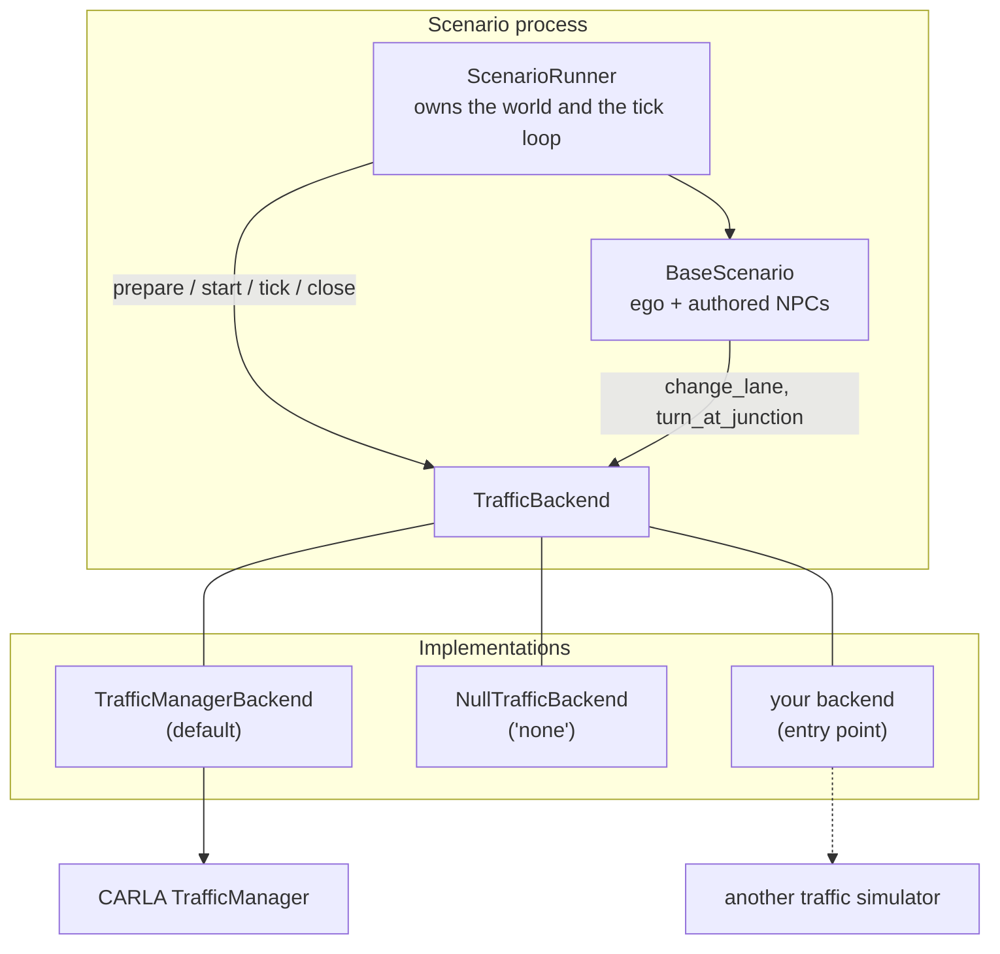

# Traffic Backends

The vehicles in a scenario come from three places, and only two of them are the
scenario's own:

- the **ego**, driven by its entity — see [External Driver Interface](driver_interface.md);
- the **authored NPCs** a scenario spawns in `setup()`;
- the **ambient traffic** that fills the rest of the road network.

A **traffic backend** owns the third kind outright and answers the manoeuvre
intents asked of the second. CARLA's TrafficManager is one such backend and is
the default. This page describes the seam, how to select a backend, and how to
write one — a microscopic traffic simulator such as SUMO, a replay of recorded
traffic, or anything else that can put vehicles on a road.

## Architecture



Two rules hold for every backend:

**One authority per vehicle.** A vehicle a backend owns is not driven by anything
else. `ScenarioRunner` passes the actors that are under external control — an
Autoware ego, a policy-driven ego — to `start()` as `skip_actor_ids`, so the rule
is data the backend is given rather than a special case it has to know about.

**An intent is not a mechanism.** `change_lane` is what the *scenario* means;
`tm.force_lane_change` and `traci.vehicle.changeLane` are what two backends do
about it. Entities ask for the first and never name the second, which is why
actions work unchanged whatever drives the vehicle.

## Selecting a backend

The `traffic` config group chooses one:

```bash
# CARLA's TrafficManager (the default — nothing to pass)
uv run scenario scenario=intersection_passing/left_turn

# No traffic model at all: only the ego and the scenario's own cars move
uv run scenario scenario=intersection_passing/left_turn traffic=none
```

| Backend | Behaviour |
| --- | --- |
| `traffic_manager` (default) | CARLA's TrafficManager drives every vehicle that is not under external control. |
| `none` | Nothing is driven and no ambient vehicle is created. |

!!! warning "`traffic=none` and the default ego"

    `ego.entity=autopilot` (the default) means *the traffic backend drives the
    ego*, so under `traffic=none` the ego does not move and the run ends on its
    timeout. Pair `traffic=none` with an ego that drives itself —
    `ego.entity=autoware` or `ego.entity=carla_driver` — or with a scenario that
    steers its vehicles itself. The backend logs how many vehicles it is leaving
    standing, so the log says why nothing moved.

A backend's own settings live under `traffic.options` and are passed to it
verbatim, so a backend from another package needs no change to this package's
config:

```yaml
traffic:
  backend: traffic_manager
  options:
    port: 8100
```

```bash
# 8101 rather than the default 8100: a second TrafficManager, so two runs
# can share one machine without steering each other's traffic.
uv run scenario traffic.options.port=8101
```

`traffic_manager.port` — where the port lived before this group existed, and what
exported scenario packages still set — keeps deciding the port when
`traffic.options.port` is left unset.

## The lifecycle

`ScenarioRunner` calls these at fixed points of a run, beside the ego entity's
own hooks:

| Method | When |
| --- | --- |
| `prepare(context)` | Before `setup()`, nothing spawned yet. Put a simulator in step, seed it, or refuse the run. |
| `adopt(entity)` | As the ego and each authored NPC join the run. The vehicle stays the scenario's. |
| `start(world, skip_actor_ids=…)` | After warm-up and the init phase, immediately before the scenario clock starts. |
| `tick(world, elapsed)` | Once per `world.tick()`. A backend driving a second simulator steps it exactly once here. |
| `close()` | During teardown, while the world is still alive. Called even when the run failed. |

One backend serves a whole queue: `ScenarioQueue` builds one runner, so over a
batch the real sequence is `prepare … close, prepare … close`, with a different
scenario — and possibly a different map — each time. `close()` is the end of a
*run*, not the end of the object: forget every vehicle created and every entity
adopted, and be ready to `prepare()` again.

`TrafficContext`, handed to `prepare()`, carries the CARLA client and world, the
map name, the OpenDRIVE the run installed, the simulation step, the scenario's
random seed and the run's output directory — everything a second simulator needs
to line itself up with the CARLA one.

Two promises matter:

- `prepare()` is the place to **fail loudly**. Raise `TrafficBackendUnavailable`
  when the simulator behind the backend is not installed, naming the extra that
  installs it; nothing has been spawned yet, so the run costs nothing.
- `tick()` and the manoeuvres must **never raise**. A traffic model that cannot
  do something logs a warning; an exception there would end a scenario that is
  otherwise perfectly valid. The base class's defaults already behave this way.

## Writing a backend

Subclass `TrafficBackend`, override what you actually do, and register a factory
under a name:

```python
from typing import Any, Collection, Mapping

from autoware_carla_scenario import TrafficBackend, TrafficContext, register_backend


class MySimulatorBackend(TrafficBackend):
    name = "my_simulator"

    def __init__(self, options: Mapping[str, Any]) -> None:
        self._address = options.get("address", "localhost:9999")

    def prepare(self, context: TrafficContext) -> None:
        # Match the simulation step so the two clocks cannot drift, and derive
        # the road network from the OpenDRIVE the CARLA world is running.
        # The map of the run: `xodr_path` is the OpenDRIVE CARLA is running, and Phase B
        # adds `lanelet2_path` for a backend whose own network is built from Lanelet2.
        self._connect(context.fixed_delta_seconds, context.xodr_path, context.random_seed)

    def start(self, world: Any, *, skip_actor_ids: Collection[int] = ()) -> None:
        self._externally_driven = set(skip_actor_ids)

    def tick(self, world: Any, elapsed: float) -> None:
        self._publish_carla_vehicles(world)   # so my traffic reacts to the ego
        self._step_once()                      # exactly one step per world tick
        self._mirror_into_carla(world)

    def close(self) -> None:
        self._disconnect()


def register() -> None:
    register_backend("my_simulator", MySimulatorBackend)
```

From your own package, advertise it so `traffic.backend=my_simulator` resolves
without an import anywhere in this repository:

```toml
[project.entry-points."autoware_carla_scenario.traffic_backends"]
my_simulator = "my_package:register"
```

### Answering manoeuvre intents

A backend that can steer the vehicles it drives overrides the three intent
methods. They receive the entity, so a backend can read the actor and record its
own bookkeeping on the vehicle rather than in a table of its own:

```python
    def change_lane(self, entity, world, direction) -> None: ...
    def lane_change_finished(self, entity, world) -> bool: ...
    def turn_at_junction(self, entity, world, direction, **kwargs) -> None: ...
```

`direction` is `LaneChangeDirection` or `TurnDirection` — intents, not CARLA
values. A backend that has no answer for one simply does not override it: the
base class logs that the intent is unavailable and the vehicle keeps doing what
it was doing, which is also what `LaneChangeAction` sees when it asks whether the
manoeuvre finished.

## Using a backend from Python

A scenario run built in code takes the backend the same way it takes the ego:

```python
from autoware_carla_scenario import NullTrafficBackend, ScenarioQueue

queue = ScenarioQueue(map_name="Town10HD_Opt", traffic_backend=NullTrafficBackend())
```

`ScenarioQueue` passes it to the `ScenarioRunner` it builds, and one backend
serves every scenario in the queue — the same way one CARLA server does.

## Why this exists

CARLA's TrafficManager is a good default for a handful of scripted NPCs and the
wrong tool for dense, demand-driven flow. Microscopic traffic simulators model
car-following, gap acceptance and route choice in ways it does not, and "does the
stack merge into a saturated flow at this intersection?" is a question about
traffic rather than about three scripted cars. The seam is what makes answering
it possible without a second scenario framework: the same map, the same scenario
document, the same conditions and the same result format, with the traffic model
swapped.

The SUMO backend is designed in `.spec-workflow/specs/traffic-simulation-backends/` in
this repository. Its network comes from the scenario's own Lanelet2 map through
[`lanelet2_to_sumo`](https://github.com/autowarefoundation/lanelet2_to_sumo) — the same
map Autoware plans on — or from a `.net.xml` the run names directly when you already have
one. No SUMO code is in the package yet.
